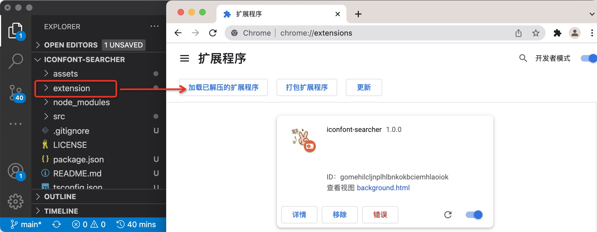
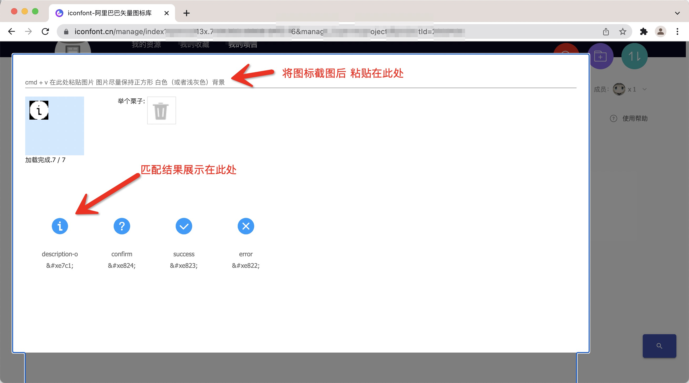

一个浏览器插件，可以使用截图匹配iconfont项目中相似的图标。    

准确率不是很高，如果有人用的话可以再想办法优化。

## usage

1. 安装依赖

```
npm i
```

2. 加载扩展程序

执行命令 "webpack"，生成 extension 目录。

进入 <a href="chrome://extensions">chrome://extensions</a>，点击“加载已解压的扩展程序“，选择刚刚生成的extension目录。



进入iconfont项目页面，点击右下角的搜索图标，将需要搜索的图标截图后粘贴到指定区域



